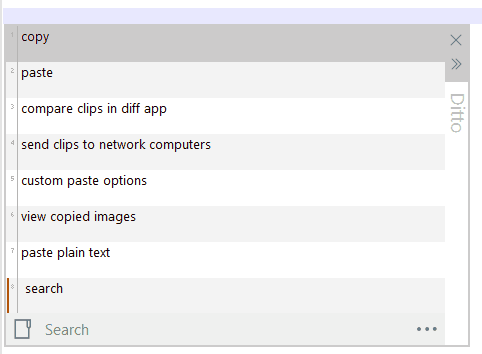

# [Ditto - Clipboard Manager](https://github.com/sabrogden/Ditto/releases/download/3.25.113.0/DittoSetup_3_25_113_0.exe)

  


[Help/Wiki](https://github.com/sabrogden/Ditto/wiki)&nbsp; &nbsp; &nbsp; &nbsp; &nbsp;&nbsp; &nbsp; &nbsp; &nbsp; &nbsp;[Forums](https://github.com/sabrogden/Ditto/issues)&nbsp; &nbsp; &nbsp; &nbsp; &nbsp;&nbsp; &nbsp; &nbsp; &nbsp; &nbsp;[Donate](https://www.paypal.com/donate/?item_name=Donation+to+Ditto&cmd=_donations&business=sabrogden%40gmail.com&Z3JncnB0=)&nbsp; &nbsp; &nbsp; &nbsp; &nbsp;&nbsp; &nbsp; &nbsp; &nbsp; &nbsp;[Beta](https://ditto-cp.sourceforge.io/beta/)&nbsp; &nbsp; &nbsp; &nbsp; &nbsp;&nbsp; &nbsp; &nbsp; &nbsp; &nbsp;[Source](https://github.com/sabrogden/Ditto)&nbsp; &nbsp; &nbsp; &nbsp; &nbsp;&nbsp; &nbsp; &nbsp; &nbsp; &nbsp;[History](https://github.com/sabrogden/Ditto/releases)

Ditto is an extension to the standard windows clipboard. It saves each item placed on the clipboard allowing you access to any of those items at a later time. Ditto allows you to save any type of information that can be put on the clipboard, text, images, html, custom formats.

## REMOVED ALL THE DOWNLOAD LINKS, DUE TO ONLY THE MASTER REPO BEING ABLE TO HAVE THEM (probbably)

## Basic Usage

1. Run Ditto
2. Copy things to the clipboard, e.g. using Ctrl-C with text selected in a text editor.
3. Open Ditto by clicking its icon in the system tray or by pressing its Hot Key which defaults to Ctrl + ` – i.e. hold down Ctrl and press the back-quote (tilde ~) key.
4. Double click or press enter on the item to paste it to the previous window.

<details>
<summary>Local Build Workflow</summary>

Prerequisites:

1. Windows
2. Visual Studio 2022 Build Tools or Visual Studio 2022
3. Desktop C++ workload
4. MSVC v143 x64/x86 build tools
5. C++ ATL for latest v143 build tools (x86 & x64)
6. C++ MFC for latest v143 build tools (x86 & x64)
7. Windows 10/11 SDK
8. NuGet
9. Inno Setup 6 if building the installer

Primary build references:

1. `.github\workflows\build.yml`
2. `CP_Main_10.sln`
3. `CP_Main.vcxproj`
4. `DittoSetup\DittoSetup_10.iss`
5. `DittoSetup\BuildPortableZIP.bat`
6. `src\Theme.cpp`
7. `src\Options.cpp`

Build the x64 executable:

```powershell
nuget restore CP_Main_10.sln
msbuild CP_Main_10.sln /p:Configuration=Release /p:Platform=x64
```

If MSVC resolves to the wrong installed toolset, force one explicitly:

```powershell
msbuild CP_Main_10.sln /p:Configuration=Release /p:Platform=x64 /p:VCToolsVersion=14.44.35207 /m
```

Expected development outputs:

```text
Release64\Ditto.exe
Release64\ICU_Loader.dll
Release64\Addins\DittoUtil.dll
```

Important packaging rule:

1. `Release64\Ditto.exe` is a development build, not the full packaged app.
2. Themes and language files are external assets.
3. Themes are loaded from `Themes\*.xml`, not embedded into the exe.
4. If a raw local build appears to have no dark themes, use the installer or portable package build instead of the bare exe.

Build the installer:

```powershell
$env:VERSION_FILENAME = '3_25_113_0_local_build'
& 'C:\Users\<user>\AppData\Local\Programs\Inno Setup 6\ISCC.exe' 'DittoSetup\DittoSetup_10.iss'
```

Expected installer output:

```text
DittoSetup\Output\DittoSetup_<VERSION_FILENAME>.exe
```

Installer inputs are defined in `DittoSetup\DittoSetup_10.iss` and include:

1. `Release64\Ditto.exe`
2. `Release64\ICU_Loader.dll`
3. `Release64\Addins\DittoUtil.dll`
4. `Debug\Language\*`
5. `Debug\Themes\*`

Build the portable zip:

```powershell
DittoSetup\BuildPortableZIP.bat "DittoPortable_local_build" bit64
```

Expected portable output:

```text
DittoSetup\Output\DittoPortable_local_build.zip
```

Agent workflow:

1. Read `.github\workflows\build.yml`
2. Restore packages
3. Build `CP_Main_10.sln` for `Release|x64`
4. Verify `Release64\Ditto.exe` exists
5. Verify `Debug\Themes` and `Debug\Language` contain XML files
6. Build either the installer or the portable package
7. Test the packaged result rather than the raw exe when checking themes or runtime assets

</details>

## Local First
- No login
- No cloud
- No telemetry

## Windows Code-Signing Policy
Free code signing on Windows binaries provided by SignPath.io, certificate by SignPath Foundation.
<br>
<br>


