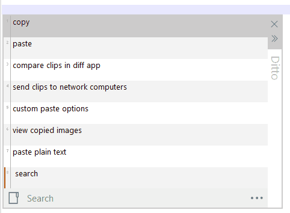

# Ditto - [Clipboard Manager](https://github.com/sabrogden/Ditto/releases/download/3.23.124.0/DittoSetup_3_23_124_0.exe)

[Help/Wiki](https://github.com/sabrogden/Ditto/wiki)&nbsp; &nbsp; &nbsp; &nbsp; &nbsp;&nbsp; &nbsp; &nbsp; &nbsp; &nbsp;[Forums](https://github.com/sabrogden/Ditto/issues)&nbsp; &nbsp; &nbsp; &nbsp; &nbsp;&nbsp; &nbsp; &nbsp; &nbsp; &nbsp;[Donate](https://www.paypal.com/donate/?item_name=Donation+to+Ditto&cmd=_donations&business=sabrogden%40gmail.com&Z3JncnB0=)&nbsp; &nbsp; &nbsp; &nbsp; &nbsp;&nbsp; &nbsp; &nbsp; &nbsp; &nbsp;[Donate with Crypto](https://commerce.coinbase.com/checkout/f3b7a516-5733-4c96-b1a7-f7602422984a)&nbsp; &nbsp; &nbsp; &nbsp; &nbsp;&nbsp; &nbsp; &nbsp; &nbsp; &nbsp;[Beta](https://ditto-cp.sourceforge.io/beta/)

Ditto is an extension to the standard windows clipboard. It saves each item placed on the clipboard allowing you access to any of those items at a later time. Ditto allows you to save any type of information that can be put on the clipboard, text, images, html, custom formats

## Download

1. [Installer 32bit](https://github.com/sabrogden/Ditto/releases/download/3.23.124.0/DittoSetup_3_23_124_0.exe)
2. [Installer 64bit](https://github.com/sabrogden/Ditto/releases/download/3.23.124.0/DittoSetup_64bit_3_23_124_0.exe)
3. [Portable 32bit](https://github.com/sabrogden/Ditto/releases/download/3.23.124.0/DittoPortable_3_23_124_0.zip)
4. [Portable 64bit](https://github.com/sabrogden/Ditto/releases/download/3.23.124.0/DittoPortable_64bit_3_23_124_0.zip)
5. [Chocolatey](https://chocolatey.org/packages/ditto)
6. [Chocolatey Portable](https://chocolatey.org/packages/ditto.portable)
7. [Windows Store App](https://www.microsoft.com/en-us/store/p/ditto-cp/9nblggh3zbjq)  

## Basic Usage

1. Run Ditto
2. Copy things to the clipboard, e.g. using Ctrl-C with text selected in a text editor.
3. Open Ditto by clicking its icon in the system tray or by pressing its Hot Key which defaults to Ctrl + ` – i.e. hold down Ctrl and press the back-quote (tilde ~) key.
4. Double click or press enter on the item to paste it to the previous window.
 

